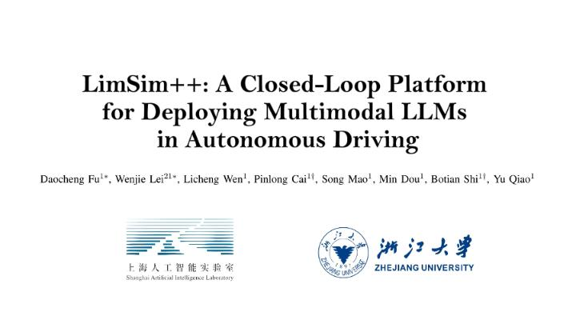
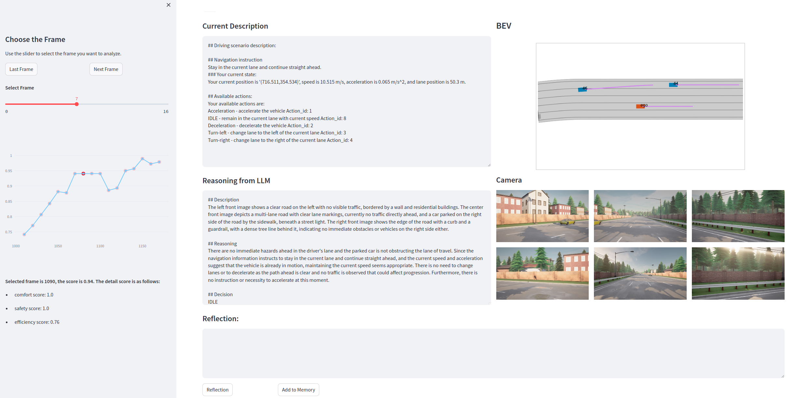

# LimSim++: A Closed-Loop Platform for Deploying Multimodal LLMs in Autonomous Driving

[](https://arxiv.org/abs/2402.01246)
[](https://pjlab-adg.github.io/limsim_plus/)
[](https://www.bilibili.com/video/BV1Eu4m1M7Y4/)


LimSim++: an extended version of LimSim designed for the application of Multimodal Large Language Models ((M)LLMs) in autonomous driving. LimSim++ addresses the need for a long-term closed-loop infrastructure supporting continuous learning and improved generalization in autonomous driving.

<!-- https://github.com/Fdarco/LimSimLLM/assets/62456817/1b6491b7-e4d9-4e2b-8a30-fc4a9df7c3b8 -->

[](https://www.bilibili.com/video/BV1Eu4m1M7Y4)

To run this project in minutes, check [Getting Started](#Getting-Started).

## Features

- **Various Scenarios**: LimSim++ offers extended-duration, multi-scenario simulations, providing crucial information for (M)LLM-driven vehicles. Various scenarios include intersection, ramp, roundabout, etc.
- **Multimodal LLMs**: LimSim++ supports LLM of different modalities as the brain for autonomous driving. LimSim++ provides rule-based scenario information generation for language-based LLM. LimSim++ supports co-simulation with Carla, which provides image information in Carla for vision-based LLM.
- **Continuous Learning**: LimSim++ consists of evaluation, reflection, memory, and other modules, which can continually enhances decision-making capabilities of (M)LLM.

## Installation

- This project uses [conda](https://github.com/conda/conda) to manage the environment
- [SUMO](https://www.eclipse.org/sumo/) >= 1.15.0
- [Carla](https://github.com/carla-simulator/carla) >= 9.14.0

After configuring the runtime environment, download the LimSim++ source code to your local machine:

```powershell
git clone https://github.com/PJLab-ADG/LimSim.git
```

Finally, you need to create environments using the ``environment.yml``:

```powershell
cd LimSim
# checkout to LimSim++ branch
git checkout LimSim_plus
# create conda environment
conda env create -f environment_linux.yml # for linux
conda env create -f environment_win.yml # for windows
```

Now, the local installation and deployment of LimSim++ is complete.

## Getting Started

### 1. Using (M)LLMs in autonomous driving 🚙

- #### LimSim++ supports Large-Language Models, such as GPT-3.5, GPT-4, etc.

To experience it, run the following command:

```bash
export OPENAI_API_KEY='your openai key' # for linux
$env:OPENAI_API_KEY='your openai key' # for windows powershell
python ExampleLLMAgentCloseLoop.py 
```

- #### LimSim++ supports Vision-Language Models, such as GPT-4V.

To experience it, You should open two terminal.

```bash
# Terminal 1
cd path-to-carla/
./CarlaUE4.sh
```

Now you should see CARLA GUI. Then switch to another terminal:

```bash
# Termnial 2
cd path-to-carla/
cd PythonAPI/util/
python3 config.py --map Town06
```

Now the map in Carla is successfully switch to Town06 map.

```bash
# Termnial 2
export OPENAI_API_KEY='your openai key'
cd path-to-LimSim/
# python ExampleModel.py
python ExampleVLMAgentCloseLoop.py
```

**Use memory module:**

To activate the memory module, set ``use_memory`` to True in ``ExampleLLMAgentCloseLoop.py``. The default setting uses 3-shots memory. You can modify it by variable `few_shot_num` in the file.

### 2. Simulation replay 🎥

In the root directory, running the following command will demonstrate the (M)LLMs decision-making process :

```bash
python ExampleReplay.py
```

> We've uploaded some simulation cases on OneDrive, which you can download and replay by clicking on the links: [Google Drive](https://drive.google.com/drive/folders/1x2H-wkl1XyxkSzkdMfnEEJMzn3QHnN_0?usp=drive_link).
>
> If you want to try a close-loop simulation with memory module, you need to download the folder `memory_library` and put it under the `db/` path.

### 3. Decisions evaluation 📝

After the (M)LLMs' autonomous driving task is completed, running the following code will evaluate the (M)LLMs' decision results :

```bash
python ExampleEvaluator.py
```

Then you can see the scores for each frame of the decision in the database, and the evaluation result of the whole route in the file ``llm_decision_result.log``.

### 4. Reflection & Memory 🧐

- #### Auto-add memory

The following command allows the LLM to self-reflect on this autonomous driving task and automatically add items to the memory library:

```bash
python simInfo/Memory.py
```

The memory database will be created in ``db/memory_library``. You can change the memory path at line 60 in the file ``simInfo/Memory.py``.

- #### Maunal-add memory

If you want to get a more intuitive feel for the entire decision-making process and want to be able to manually intervene in the reflection process, you can run the following code:

```bash
streamlit run manual_reflection.py
```

A web page will then pop up where you can view the reasoning process for each frame. The **`reflection`** button allows you to get the results of the reflection output by LLM. If you think that the reflection result from LLM is not reliable, you can change it directly in the **input box**. Finally, by clicking on the **`add to Memory`** button, the reflection for this frame decision will be added to the memory library.

You can change the database path and memory path at line 128-137 in the file ``manual_reflection.py``.

**Note: If the reflection result from LLM is short, you might consider changing to a different LLM model to achieve a better experience.**



## Create Your Own Driving Agent

### ⚙️ Prompt Engineering

> LimSim++ supports user-defined prompts.

- You can change system prompt of the Driver Agent by modifying ``simInfo/system_message.txt``.
- You can change QA pair example by modifying ``simInfo/example_QA.txt`` to make the Driver Agent better compliance with format requirements.
- Furthermore, you can customize the information description of the current scenario by modifying ``simInfo/prompt_template.json``. **Be careful not to modify the contents in `{}`.**

### 💯 Model Evaluation

> LimSim++ supports user-defined evaluation.

- The evaluation methods used in the baseline contain some hyperparameters. You can set your evaluation preferences by modifying ``simInfo/Evaluation.py``.
- You can completely replace the evaluation algorithm with your own algorithm.

### 🦾 Framework Enhancement

> LimSim++ supports the construction of tool libraries for customized applications .

- You can add your own tools for Driver Agent in the project (``ExampleLLMAgentCloseLoop.py``, ``ExampleVLMAgentCloseLoop.py``).

## License and Citation

All assets and code in this repository are under the Apache 2.0 license. If you use LimSim++ in your research , please use the following BibTeX entry.

```
@article{fu2024limsim++,
  title={LimSim++: A Closed-Loop Platform for Deploying Multimodal LLMs in Autonomous Driving},
  author={Fu, Daocheng and Lei, Wenjie and Wen, Licheng and Cai, Pinlong and Mao, Song and Dou, Min and Shi, Botian and Qiao, Yu},
  journal={arXiv preprint arXiv:2402.01246},
  year={2024}
}
```
