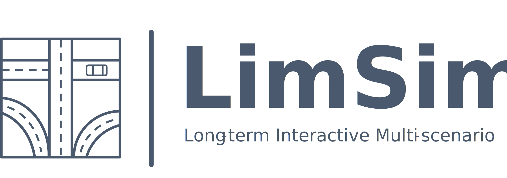

<!-- [](https://www.bilibili.com/video/BV1rT411x7VF) -->
[](https://www.bilibili.com/video/BV1rT411x7VF)
[](https://youtu.be/YR2A25v0hj4)

## News: 🚀The code is now released!
# LimSim

LimSim is a Long-term Interactive Multi-scenario traffic Simulator, which aims to provide a continuous simulation capability under the complex urban road network.


## 🎁 Main Features

- [x] **Long-term**: Traffic flow can be generated over long periods under the guidance of demand and route planning.

- [x] **Diversity**: The built-in behavioral models take heterogeneous driving styles of vehicles into account.

- [x] **Interactivity**: Vehicles in the scenario area are controlled  address sophisticated interactions among vehicles.

- [x] **Multi-scenario**: The universal road components supports a variety of road structures in the real world.

## 🖥️ GUI

LimSim has a cross-platform user-friendly GUI, which includes not only a beautiful simulation interface, but also information on road network and ego-vehicle status.
<p align="center">
  
</p>


## 🛣️ Multi-scenarios support

LimSim supports road scenarios not limited to freeways, signalized intersections, roundabouts and overpasses.

<p align="center">
 
</p>


## 📊 Scenario Evaluation

After running a long-term simulation with all kinds of scenarios contained in it, LimSim generates a log report and extract the key scenarios via the evaluation results.

<p align="center">
 
</p>


## 💡Co-sim with SUMO & CARLA

LimSim supports co-simulation with CARLA and SUMO, guaranteeing that all three softwares show identical vehicle status. 

<p align="center">
 
</p>

## ➕Additional Maps

LimSim supports the `freewayB` and `Expressway_A` maps from the CitySim datasets. However, we have not included these two road network files in this library due to copyright.

To run these two maps, you need to:
1. Go to [CitySim Repo](https://github.com/ozheng1993/UCF-SST-CitySim-Dataset#Full%20Data%20Access) and submit the data access form.
2. Get access to the dataset and download the **`.net.xml` files** in both the `freewayB` and `Expressway_A` data folders.
3. Copy the road network files (.net.xml) to the relevant `networkFiles/CitySim` folder and ensure that your file paths are as follows:
   ```
   networkFiles/CitySim/freewayB/freewayB.net.xml
   networkFiles/CitySim/Expressway_A/Expressway_A.net.xml
   ```

<!-- ## Cite -->


## Acknowledgments

We would like to thank the authors and developers of the following projects, this project is built upon these great projects.
- [SUMO (Simulation of Urban MObility)](https://sumo.dlr.de/)
- [CitySim](https://github.com/ozheng1993/UCF-SST-CitySim-Dataset)


## Contact

If you have any suggestions or collaboration about this repo, feel free to create a issue/PR or send email to us (<a href="mailto:wenlicheng@pjlab.org.cn">wenlicheng@pjlab.org.cn</a>).

## License

LimSim is released under the [Apache 2.0 license](https://github.com/PJLab-ADG/SensorsCalibration/blob/master/LICENSE).
