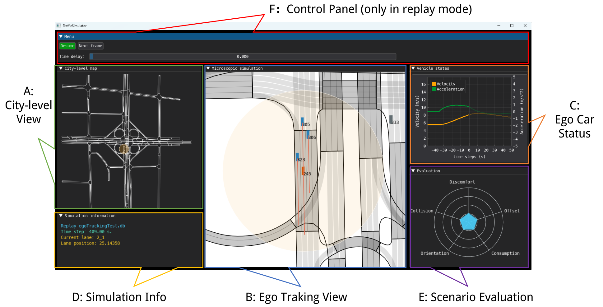
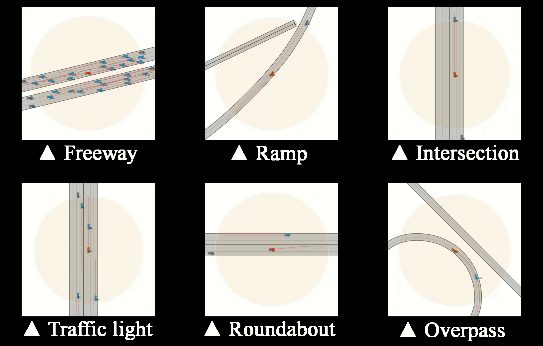
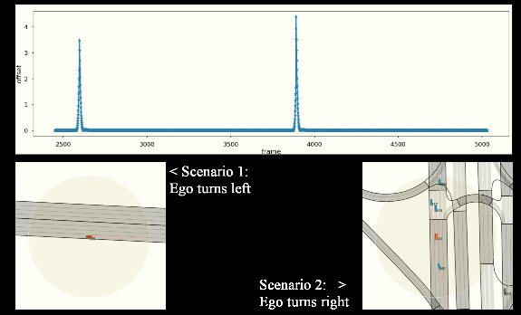

[](https://arxiv.org/abs/2307.06648)
[](https://pjlab-adg.github.io/LimSim)
[](https://www.bilibili.com/video/BV1rT411x7VF)
[](https://youtu.be/YR2A25v0hj4)

## 🚀News: 

- **2024/03/05** [LimSim++](https://github.com/PJLab-ADG/LimSim/tree/LimSim_plus) is now released!
- **2023/07/26** Add [the docs](https://pjlab-adg.github.io/LimSim/zh/GettingStarted/carla_cosim/) about co-sim with CARLA.
- **2023/07/13** The code is now released!
  
# LimSim

LimSim is a Long-term Interactive Multi-scenario traffic Simulator, which aims to provide a continuous simulation capability under the complex urban road network.

## Quick Start

- **3.9.0** <= [Python](https://www.python.org/) <= 3.11.0
- [SUMO](https://www.eclipse.org/sumo/) >= 1.15.0 

After configuring the runtime environment, download the LimSim source code to your local machine:

```powershell
git clone https://github.com/PJLab-ADG/LimSim.git
```

Finally, you need to install the required Python extensions:

```powershell
cd LimSim
pip install -r requirements.txt
```

Now, the local installation and deployment of LimSim are complete.

### 1. Real-time Sim
Real-time simulation following the Ego vehicle is the fundamental feature of LimSim. To experience it, run the following command:

```bash
python ModelExample.py
```

### 2. Simulation replay
In the root directory, running the following command will invoke LimSim's replay feature:

```powershell
python ReplayExample.py
```

**For more information of our code, please see our [Online Documentation](https://pjlab-adg.github.io/LimSim/)**.

If you have any problem when installing and deployment, feel free to [open an issue here](https://github.com/PJLab-ADG/LimSim/issues)!


## 🎁 Main Features

- [x] **Long-term**: Traffic flow can be generated over long periods under the guidance of demand and route planning.

- [x] **Diversity**: The built-in behavioral models take heterogeneous driving styles of vehicles into account.

- [x] **Interactivity**: Vehicles in the scenario area are controlled  address sophisticated interactions among vehicles.

- [x] **Multi-scenario**: The universal road components supports a variety of road structures in the real world.

## 🖥️ GUI

LimSim has a cross-platform user-friendly GUI, which includes not only a beautiful simulation interface, but also information on road network and ego-vehicle status.
<p align="center">
  
</p>


<details><summary><h2>🛣️ Multi-scenarios support</h2></summary>
<p>
  

LimSim supports road scenarios not limited to freeways, signalized intersections, roundabouts and overpasses.

<p align="center">
 
</p>


</p>
</details>


<details><summary><h2>📊 Scenario Evaluation</h2></summary>
<p>
  

After running a long-term simulation with all kinds of scenarios contained in it, LimSim generates a log report and extract the key scenarios via the evaluation results.

<p align="center">
 
</p>


</p>
</details>


<details><summary><h2>💡Co-sim with SUMO & CARLA</h2></summary>
<p>

LimSim supports co-simulation with CARLA and SUMO, guaranteeing that all three softwares show identical vehicle status.  Please see [the docs](https://pjlab-adg.github.io/LimSim/zh/GettingStarted/carla_cosim/) for more information.

<p align="center">
 
</p>


</p>
</details>


## ➕Additional Maps

LimSim supports the `freewayB` and `Expressway_A` maps from the CitySim datasets. However, we have not included these two road network files in this library due to copyright.

To run these two maps, you need to:
1. Go to [CitySim Repo](https://github.com/ozheng1993/UCF-SST-CitySim-Dataset#Full%20Data%20Access) and submit the data access form.
2. Get access to the dataset and download the **`.net.xml` files** in both the `freewayB` and `Expressway_A` data folders.
3. Copy the road network files (.net.xml) to the relevant `networkFiles/CitySim` folder and ensure that your file paths are as follows:
   ```
   networkFiles/CitySim/freewayB/freewayB.net.xml
   networkFiles/CitySim/Expressway_A/Expressway_A.net.xml
   ```

## Acknowledgments

We would like to thank the authors and developers of the following projects, this project is built upon these great projects.
- [SUMO (Simulation of Urban MObility)](https://sumo.dlr.de/)
- [CitySim](https://github.com/ozheng1993/UCF-SST-CitySim-Dataset)
- [DearPyGUI](https://dearpygui.readthedocs.io/en/latest/?badge=latest)


## Contact

If you have any suggestions or collaboration about this repo, feel free to create a issue/PR or send email to us (<a href="mailto:wenlicheng@pjlab.org.cn">wenlicheng@pjlab.org.cn</a>).


## Citation
If you use LimSim in your research , please use the following BibTeX entry.
```
@misc{wen2023limsim,
      title={LimSim: A Long-term Interactive Multi-scenario Traffic Simulator}, 
      author={Licheng Wen and Daocheng Fu and Song Mao and Pinlong Cai and Min Dou and Yikang Li and Yu Qiao},
      year={2023},
      eprint={2307.06648},
      archivePrefix={arXiv},
      primaryClass={eess.SY}
}
```

## License

LimSim is released under the [GNU GPL v3.0 license](https://github.com/PJLab-ADG/limsim/blob/master/LICENSE).
